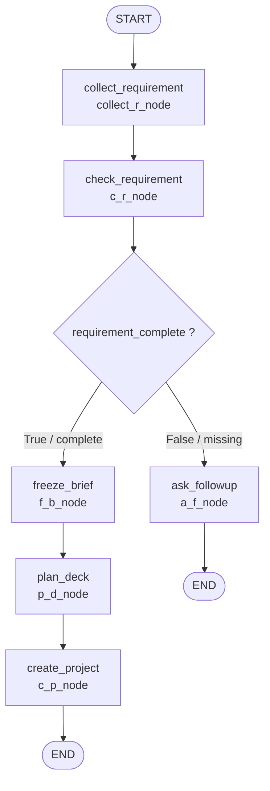

# Graph Flow

这份流程图用于编写 `ppt_agent/graph.py`。

## Mermaid 流程图



## LangGraph 节点顺序

```text
START
  -> collect_requirement
  -> check_requirement
  -> route_after_check
       -> ask_followup
       -> freeze_brief
  -> plan_deck
  -> create_project
  -> END
```

## 节点和函数对应关系

| Graph Node Name | Function |
| --- | --- |
| `collect_requirement` | `collect_r_node` |
| `check_requirement` | `c_r_node` |
| `ask_followup` | `a_f_node` |
| `freeze_brief` | `f_b_node` |
| `plan_deck` | `p_d_node` |
| `create_project` | `c_p_node` |

## 条件路由

`check_requirement` 后面要判断：

```python
state.get("requirement_complete")
```

如果是 `True`：

```text
freeze_brief
```

如果是 `False`：

```text
ask_followup
```

## graph.py 结构参考

```python
from langgraph.graph import END, START, StateGraph

from ppt_agent.state import State
from ppt_agent.nodes.collect_requirement import collect_r_node
from ppt_agent.nodes.check_requirement import c_r_node
from ppt_agent.nodes.ask_followup import a_f_node
from ppt_agent.nodes.freeze_brief import f_b_node
from ppt_agent.nodes.plan_deck import p_d_node
from ppt_agent.nodes.create_project import c_p_node


def route_after_check(state: State) -> str:
    if state.get("requirement_complete"):
        return "complete"

    return "missing"


builder = StateGraph(State)

builder.add_node("collect_requirement", collect_r_node)
builder.add_node("check_requirement", c_r_node)
builder.add_node("ask_followup", a_f_node)
builder.add_node("freeze_brief", f_b_node)
builder.add_node("plan_deck", p_d_node)
builder.add_node("create_project", c_p_node)

builder.add_edge(START, "collect_requirement")
builder.add_edge("collect_requirement", "check_requirement")

builder.add_conditional_edges(
    "check_requirement",
    route_after_check,
    {
        "missing": "ask_followup",
        "complete": "freeze_brief",
    },
)

builder.add_edge("ask_followup", END)
builder.add_edge("freeze_brief", "plan_deck")
builder.add_edge("plan_deck", "create_project")
builder.add_edge("create_project", END)

graph = builder.compile()
```
